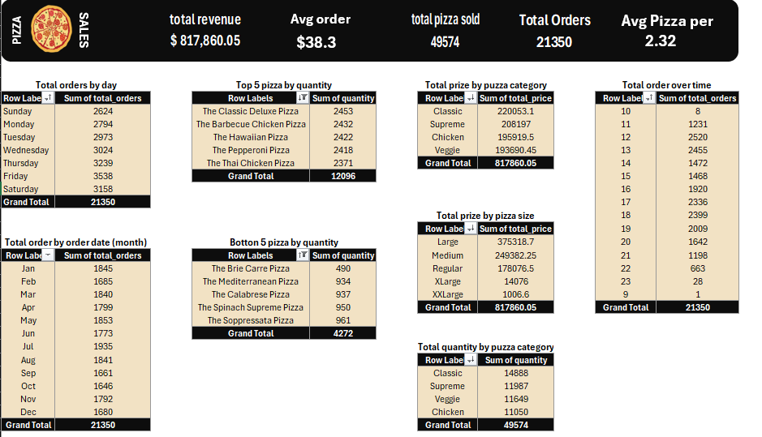

# 🍕 pizza-sales-dashboard

**Summarization of data for a pizzeria (~50K rows) using Excel pivot tables.**

---

## 📁 Project Structure

- `Pizza_Dataset.xlsx` → Original sales dataset containing order-level data
- `pizza_dashbord.png` → Dashboard image summarizing key metrics visually
- `README.md` → Project documentation (this file)

---

## 🧰 Tools Used

- **Microsoft Excel** – for data cleaning, transformation, and visualization using Pivot Tables
- **Git & GitHub** – for version control and project sharing

---

## 📊 Dashboard KPIs

The dashboard includes the following key performance indicators:

- ✅ **Total Orders**
- 💰 **Total Revenue**
- 🍕 **Top-Selling Pizza Types**
- 📆 **Monthly & Daily Sales Trends**
- 🕐 **Peak Order Hours**

---

## 🧠 Insights

- **Weekend sales** (especially on **Fridays and Saturdays**) are consistently higher than weekdays
- **"Classic Deluxe"** and **"Barbecue Chicken"** are the top-performing pizza types
- The busiest period for orders is between **6 PM and 9 PM**, showing strong demand during dinner hours
- Seasonal peaks are observed in months like **July** and **December**
